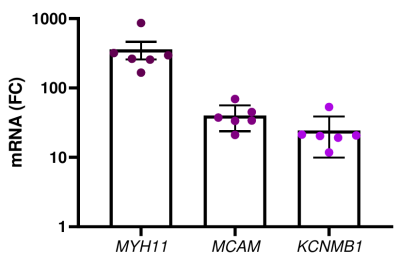

```{r setup, include=FALSE}
knitr::opts_chunk$set(echo=TRUE, warning=FALSE, eval=FALSE)
```

## PI

Name: [Ola Hansson](https://www.ludc.lu.se/ola-hansson-pi) & 
      [Karl Swärd](https://www.lunduniversity.lu.se/lucat/user/d6a67258cd7d2448a83f44c29cbda4e8)

Email: [ola.hansson@med.lu.se](mailto:ola.hansson@med.lu.se), 
       [karl.sward@med.lu.se](mailto:karl.sward@med.lu.se)


## Project

Smooth muscle cells from the human coronary artery were treated either with *Ad-CMV-null* or *Ad-CMV-MYOCD*, i.e. adenovirsuses that express nothing or myocardin under control of CMV promoter. There were 4 virus induced and 4 control samples. Timepoint: ~ 96h or 120h or 140h. They were RNA-Seq sequenced using Stranded Total RNA Library Prep kit.

The raw sequencing data is stored in `201022_NB501805_0127_AHY7KCBGXG`.

We want to **test whether myocarding is a splicing regulator**. To that end, we look for
splicing variation in several genes that are over-expressed by viral transduction of
myocarding.

- CMV - control
- MYO - virus induced.

There is no need to control for confounding factors because the parental cells are
split into wells that get either null or *MYOCD*. 

Expression of myocardin (*MYOCD*) can be used as control.

As positive control genes verifying that *MYOCD* over expression worked we can look at *MYH11*, *MCAM* and *SYNM* for example. In addition there are hundreds of genes that respond well, but not as much as those above. It would be important to know if much less responsive target genes have also moved in the experiment. Examples include *RRAS*, *RBPMS*, and *RBPMS2*. Two of these (*RBPMS* and *RBPMS2*) are the splicing factors that we believe are regulated by *MYOCD* and that effectuate downstream changes in splicing. Important to know consequently if they change.

We also have qPCR information in *MYH11, MCAM, KCNMB1*:



Differentially splicing of the following genes is of interest:

*ACTN1, SMTN, NFIC, BICD2, TEAD1, TPM1, TPM2, PDLIM7, FHL1, CSR2,
TGFB11, PKD1, MYL6, PDLIM5, FLNA, MBNL1, ZFR, FNBP1, SORBS1, PIP5K1C,
TNRC18, SVIL, KLHL42, LARGE1, MICAL3*

This is provided that *RBPMS* and *RBPMS2* are differentially expressed.

## Data

The raw data and all files of this project are stored on the Indigo cluster at LUDC:

`indigo.crc.med.lu.se:/ludc/Active_Projects/myocardin_splicing/`

## Prerequisites

You need to install [Conda](https://conda.io) and load the pre-configured conda
environment. It should also install all the required programs.

```{bash}
conda env create -f conf/conda.yml
conda activate myocardin
```

## Quality Control (QC)

Quality Control (QC) of the fastq files and other data are summarized in
`results/reports/multiQC`

## Map and count reads at exon and gene level

1. Map reads to the genome reference with [STAR](https://github.com/alexdobin/STAR) 
in 2-pass mode.

2. Count reads mapped to genes and exons with [featureCounts](http://bioinf.wehi.edu.au/featureCounts/).

Rules are added to the same `code/Snakefile`:

```{bash}
snakemake -s code/Snakefile \
   -j 100 \
   -p --use-conda \
   --cluster-config conf/cluster.yml \
   --cluster "condor_qsub -o logs/{rule}.out -e logs/{rule}.err -l procs={cluster.cores},mem={cluster.ram} -V"
```

Results:

- `results/tables/featureCounts/featureCounts_counts_gene.csv.gz` - gene counts.
- `results/tables/featureCounts/featureCounts_counts_exon.csv.gz` - exon counts data.
- `results/tables/featureCounts/featureCounts_counts_exon.csv.jcounts` - number of reads supporting each exon-exon junction.

## Differential gene expression

Performed with [DESeq2](https://bioconductor.org/packages/release/bioc/vignettes/DESeq2/inst/doc/DESeq2.html):

```{bash}
R -e 'rmarkdown::render("code/DESeq.Rmd", output_dir="results/reports/")'
```

Results:

- `results/reports/DESeq.html` - report describing the analysis.

- `results/tables/DESeq/DESeq_all.xlsx` - differential expression results.

- `results/tables/DESeq/DESeq_interesting.xlsx` - differential expression results
  for provided list of potential candidate genes.

Column names in the tables:

- *baseMean* - mean of normalized counts for all samples. 
- *log2FoldChange* - log2 fold change (MLE): condition treatment vs control.
- *lfcSE* - standard error.
- *stat* - Wald statistic.
- *pvalue* - Wald test p-value.
- *padj* - BH adjusted p-values.
- *\_tpm* - transcript per million (TPM) normalized count data.

**TPM normalization**.

Divide the read counts by the length of each gene in kilobases. This gives you reads per kilobase (RPK).
Count up all the RPK values in a sample and divide this number by 1,000,000. This is your "per million" scaling factor.
Divide the RPK values by the "per million" scaling factor. This gives you TPM.

When you use TPM, the sum of all TPMs in each sample are the same. This 
makes it easier to compare the proportion of reads that mapped to a gene
in each sample. In contrast, with RPKM and FPKM, the sum of the 
normalized reads in each sample may be different, and this makes it 
harder to compare samples directly.

Here’s an example. If the TPM for gene A in Sample 1 is 3.33 and the TPM
in sample B is 3.33, then I know that the exact same proportion of 
total reads mapped to gene A in both samples. This is because the sum of
the TPMs in both samples always add up to the same number (so the 
denominator required to calculate the proportions is the same, 
regardless of what sample you are looking at.)

Optionally, I run the enrichment analysis in the DE genes with *clusterProfiler* but if
we decide that we need itm I would re-do it with [WebGestalt](http://www.webgestalt.org/)
as I have doe for DEXSeq results below.

```{bash}
R -e 'rmarkdown::render("code/clusterProfiler.Rmd", output_dir="results/reports/")'
```

## Splicing analyses

### Differential exon usage

Performed with [DEXSeq](https://bioconductor.org/packages/release/bioc/vignettes/DEXSeq/inst/doc/DEXSeq.html):

```{bash}
R -e 'rmarkdown::render("code/DEXSeq.Rmd", output_dir="results/reports/")'
Rscript code/DEXSeq_to_exons.R
```

Results:

- `results/reports/DEXSeq.html` - report describing the analysis.

- `results/reports/DEXSeqReport/DEXSeq_results.html` - DEXSeq results.

- `results/reports/DEXSeqReport/files/*.svg` - figures that can be used in a publication.

- `results/tables/DEXSeq/DEXSeq_results.csv` - results of the differential exon usage analysis.

- `results/tables/DEXSeq/genelevel_FDR.csv` - gene-level FDR values.

- `results/tables/DEXSeq/DEXSeq_results_bins2exons.csv` - correspondence between the DEXSeq bins and real exons.

Results interpretation

The exon order and genes are presented as in the reference. Strand of a gene can vary:

   - `+` - positive, or 5'->3'
   - `-` - negative, or 3'->5'
   - `.` - undetermined.

You can find this information in `intermediate/gene_coord_strand.csv`

### Splicing events analysis

Performed with [rMATS](http://rnaseq-mats.sourceforge.net/).

The code is added to `code/Snakefile`.

To visualize the results I used two programs:
[maser](https://www.bioconductor.org/packages/release/bioc/vignettes/maser/inst/doc/Introduction.html)
and
[rmats2sashimiplot](https://github.com/Xinglab/rmats2sashimiplot/)

The key result is presented in `PSI` - differential percent spliced-in, i.e. relative abundance.

#### maser

Select only significant events (FDR=0.05) with minimum change of 10% and average
coverage of the splice event by 3 reads.

```{bash}
R -e 'rmarkdown::render("code/maser.Rmd", output_dir="results/reports/")'
```

Results:

- `results/figures/rMATS/` - plots.

- `results/tables/rMATS/` - tables.


Maybe [add proteins info](https://www.bioconductor.org/packages/release/bioc/vignettes/maser/inst/doc/Protein_mapping.html) to selected candidates.

#### rmats2sashimiplot

First, I extracted the signficant events only:

```{bash}
for i in SE A5SS A3SS RI;
   do
      awk -F'\t' 'NR==1 || $20<=0.05' results/tables/rMATS_bam/${i}.MATS.JC.txt \
         > results/tables/rMATS_bam/${i}.MATS.JC.sign.txt;
   done

awk -F'\t' 'NR==1 || $22<=0.05' results/tables/rMATS_bam/MXE.MATS.JC.txt \
   > results/tables/rMATS_bam/MXE.MATS.JC.sign.txt
```

Then, plotted them with:

```{bash}
for i in SE A5SS A3SS MXE RI;
  do
    rmats2sashimiplot \
      --b1 intermediate/STAR/CMV1_pass2/CMV1.Aligned.out.sorted.bam,intermediate/STAR/CMV2_pass2/CMV2.Aligned.out.sorted.bam,intermediate/STAR/CMV4_pass2/CMV4.Aligned.out.sorted.bam,intermediate/STAR/CMV5_pass2/CMV5.Aligned.out.sorted.bam \
      --b2 intermediate/STAR/MYO1_pass2/MYO1.Aligned.out.sorted.bam,intermediate/STAR/MYO2_pass2/MYO2.Aligned.out.sorted.bam,intermediate/STAR/MYO4_pass2/MYO4.Aligned.out.sorted.bam,intermediate/STAR/MYO5_pass2/MYO5.Aligned.out.sorted.bam \
      -t $i \
      -e results/tables/rMATS_bam/${i}.MATS.JC.sign.txt \
      --l1 CMV \
      --l2 MYO \
      -o intermediate/rmats2sashimiplot/rmats2sashimiplot_${i} \
      --group-info conf/grouping.gf
      mv intermediate/rmats2sashimiplot/${i}/Sashimi_plot results/figures/rmats2sashimiplot/${i};
  done
```

I added this code to `code/Snakefile`, but it gives non-crucial errors and fails in Snakemake (non-zero exit error). I had to submit a condor job directly with
`code/rmats2sashimiplot.condorjob` and `code/rmats2sashimiplot.sh`:

```{bash}
condor_submit code/rmats2sashimiplot.condorjob
```

Results:

   - `results/figures/rmats2sashimiplot/` - plots for all rMATS significant events.

### Isoform-based analysis

#### Isoform Switch Analysis

Transcrips were counted with [Salmon](https://salmon.readthedocs.io/en/latest/index.html)
The code is added to `code/Snakefile`.

Then the counts were tested for differential transcript usage with
[IsoformSwitchAnalyzeR](https://bioconductor.org/packages/devel/bioc/vignettes/IsoformSwitchAnalyzeR/inst/doc/IsoformSwitchAnalyzeR.html):

```{bash}
R -e 'rmarkdown::render("code/IsoformSwitchAnalyzeR.Rmd", output_dir="results/reports/")'
```

Results:

- `results/tables/IsoformSwitchAnalyzeR/` - RData file with all results and some results tables.
   
- `results/figures/IsoformSwitchAnalyzeR/` - plots for significant results (FDR=0.05 and min dIF=0.1).


### Enrichment

Performed with [WebGestalt](http://www.webgestalt.org/):

   - DESeq2 results were tested with the **GSEA** method
   
   - Splicing results were tested with the **ORA** method

```{bash}
mkdir -p results/reports/WebGestaltR/
R -e 'rmarkdown::render("code/WebGestaltR.Rmd", output_dir="results/reports/WebGestaltR/")'
```

Results:

- `results/reports/WebGestaltR/` - reports with figures and tables.

**Gene Set Enrichment Analysis (GSEA)** eliminates the need for an ad hoc cutoff (e.g. FDR<0.05) that is used in defining the input gene set in the ORA analysis. GSEA works by ranking all analyzed genes according to the fold change, and tests whether any annotated gene set is ranked unexpected high or low through running-sum statistic.

**Over-representation Analysis (ORA)**. ORA counts the number of common functions shared by an input gene set (e.g. all genes with splicing) and each annotated gene set (e.g. all analyzed genes), and applies a statistical test to calculate the statistical significance of the overlap.

The result files have either *ORA* or *GSEA* in their filenames respectively.


### Overlap

How many exons/transcripts and genes that show alternative splicing overlap betweem analyses
(FDR: DEXSeq=0.01, rMAT=0.05,  ISA=0.05):

```{bash}
R -e 'rmarkdown::render("code/splicing_overlap_DEXSeq_rMATS_ISA.Rmd", output_dir="results/reports/")'
```

Results:

   - `results/figures/rMATS_DEXSeq_ISA_overlap/` - venn diagra showing overlaps.
   
   - `results/tables/rMATS_DEXSeq_ISA_overlap/` - tables showing overlaps for genes that are significant in at least two (`atleast2overlap`) and all three (`all3overlap`) analyses.

   
*Note, only the comparison DEXSeq bins to rMATS exons is reliable here. ISA is transcript based, so it cannot be directly compared to the exon-based results., but I included it for additional information.*

## SLMAP

SLMAP showed differential exon usage results, but it was not significant in the ISA.
I try to create the ISA-like plot to reflect the differential exon usage results.

```{bash}
R -e 'rmarkdown::render("code/SLMAP_visualization.Rmd", output_dir="results/reports/")'
```

Results:

   - `results/figures/IsoformSwitchAnalyzeR/SLMAP_ed.pdf`- manually edited plot.


## MSAT

To infer some in vivo results, we look at the correlation of MYOCD with
exons of a few genes of interest in the MSAT data as well as correlation in
the fold change between two datasets. In the MSAT data, I compared two groups that had
high and low expression of MYOCD.

```{bash}
R -e 'rmarkdown::render("code/DEXSeq_MSAT.Rmd", output_dir="results/reports/")'
R -e 'rmarkdown::render("code/MSAT_correlation_MYOCD.Rmd", output_dir="results/reports/")'
```

Results:

   - `results/reports/MSAT_correlation_MYOCD.html`- results.
   
Unfortunately, the signal is very weak.
   

```{bash, include=FALSE, eval=FALSE}
rsync -aAXv --dry-run --progress -e 'ssh -p 22022' \
   --exclude="toDo.txt" \
   --exclude="*.directory" \
   --exclude="*.Rhistory" \
   --exclude="*.RData" \
   --exclude=".snakemake" \
   --exclude="logs" \
   --exclude="data" \
   --exclude="notes" \
   --exclude="intermediate" \
   --exclude=".git" \
   ~/Science/myocardin_splicing_Ola_Karl/ \
   dmytro_k@indigo.crc.med.lu.se:/ludc/Active_Projects/myocardin_splicing/Private/
```
